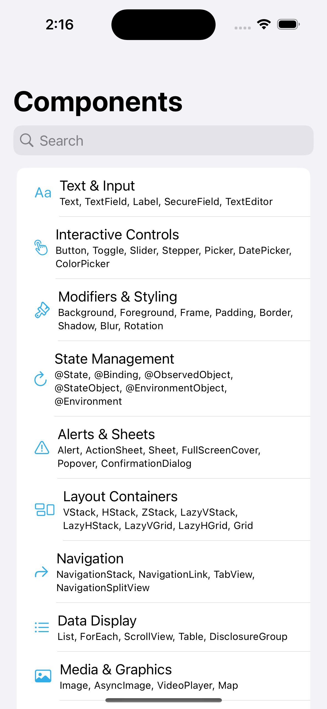

# UIPlayground

A simple SwiftUI playground for exploring components and interactions.

## Screenshot

## Requirements
- iOS 16.0+
- Xcode 16.0+

## Getting Started
1. Clone the repository
2. Open `UIPlayground.xcodeproj` in Xcode
3. Build and run the project

## License
See LICENSE file for details.
